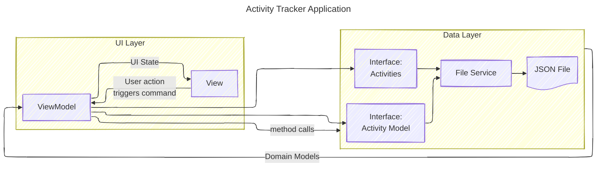

<!-- markdownlint-disable MD033 -->

# pppActivityTracker

## Introduction

For fun, ppp stands for Paul Painter Python. I created this project to spend sometime learning more about python. I have been writing software since the summer of 1978, using many different programming languages, IDEs, platforms and frameworks. There as some basic fundamentals common to everyone, like debugging, logging, user interface, etc. When I started on IBM mainframes in college, the only input source was punched cards and output was on a line printer.

So, in this app, I spent time learning the most common and easy means to support logging to the console and a log file, storing data in files, using event-driven and multiple threads. I chose ttkbootstrap because it seemed easiest to learn and I am old enough to have used TCL/tk when it first was introduced.

Also, I wanted to learn pytest and strive to keep all the unit tests running at 100% coverage. This project was just a hobby for me. If you find it helpful, please drop me a comment.

## Description

pppActivityTracker is a simple GUI App to enter activities in a log with a start and stop time, a short descriptor of an activity and additional notes. The duration of the activity in minutes is computed. Weekly summaries of the activities can be shown.

The data is stored in a local json file.

An approximation of the MVVM pattern is employed. For starters, the viewmodel binds to the model using only a uri and some abstract interfaces, in the first case, a filename, or a simple json file binding. The main program defines an Application class which creates the view and the viewmodel supporting commands and properties. I looked at a few projects out there for python MVVM apps, but nothing fit my need for simplicity.

## Project Structure

```txt
pppActivityTracker (project root)
│
├── model/
│   ├── ae.py (ActivityEntry dataclass)
│   └── atmodel.py (ActivityTracker Model)
│
├── viewmodel/
│   └── MainATViewModel.py (Activity Tracker viewmodel)
│
├── view/
│   ├── atview.py (Activity Tracker view)
|   └── interfaces/
│
├── tests/
│   ├── pytest.ini 
│   ├── conftest.py 
│   ├── test_ae.py 
│   ├── test_events.py 
│   ├── test_logging.py 
│   ├── test_atutilities.py 
│   ├── test_atviewmodel.py 
│   └── file_atmodel.py/
|
├── at_utilities/
│   ├── at_events.py 
│   ├── at_logging.py (unit test for ActivityEntry dataclass)
│   └── at_utils.py/
|
├── docs/
|
├── README.md
├── requirements.txt
└── main.py (The program main)
```

### About Unit Testing and Logging

Learning about pytest was fun. I worked hard to setup the project to support pytest runs both within vscode and stand-alone with a single fundtion to configure logging for all the scenarios. Also, I wanted to be able to debug any .py file stand-alone as well as from pytest "debug test" in vscode. That took some learning but seems to work well.

## MVVM Pattern Basics

First, attribution to [Divikiran Ravela](https://www.linkedin.com/pulse/understanding-mvvm-pattern-guide-junior-every-divikiran-ravela/) for his
succinct article [Understanding the MVVM Pattern: A Guide for Junior (every) Developers](https://www.linkedin.com/pulse/understanding-mvvm-pattern-guide-junior-every-divikiran-ravela/) from which I extracted these brief notes.

>In the MVVM Pattern, the relationships between the components are structured to maintain *Separation of Concerns*.

### The Model

>The Model represents the data and business logic of the application. It encapsulates the data and operations, ensuring that the data remains independent of the presentation logic.

### The View

>The View is responsible for presenting the user interface to the end-users. It displays the data to the user and captures their input.

### The ViewModel

>The ViewModel acts as a mediator between the View and the Model. It provides data and commands required by the View, often in the form of properties and methods, while abstracting the complexity of the Model from the View. This decoupling allows the View to be easily redesigned or replaced without affecting the underlying business logic.

### View knows about ViewModel

>The ViewModel holds a reference to the Model and interacts with it to retrieve and manipulate data. It transforms the data from the Model into a format suitable for the View and exposes it through properties that the View can bind to.

### Model remains unaware of the ViewModel

>The Model operates independently of the ViewModel and has no knowledge of it. This isolation allows the Model to evolve and change without affecting the ViewModel or the View, promoting modularity and flexibility.

With some help from [Microsoft Copilot](#copilotOne), here are some additional notes about the MVVM pattern.

### Key Components in MVVM Data Binding

In the MVVM design pattern, data binding is a core mechanism that connects the View (UI elements) with the ViewModel (the mediator between the View and Model). This binding ensures synchronization, meaning changes in the ViewModel automatically reflect in the View and, in some cases, vice versa. Data binding acts as a communication bridge between the View and ViewModel. It is typically implemented as a declarative link, often enabled through a framework or platform that supports this pattern.

#### Binding View to ViewModel

A ViewModel exposes properties as interfaces for a caller, in this case, the View. A common approach for this is to use a generic object known as the DataContext with the declared and bound properties names expected as getr/setr methods. Managing the naming conventions is typically framework-specific.

Each UI element, such as TextBox, CheckBox, etc., will have an associated binding to the name of the property available from the DataContext. The DataContext is initialized at setup time when a View is bound to a ViewModel. How I will set that up in python remains to be seen.

#### Binding ViewModel to View

Similarly, a ViewModel is bound to a Model using published interfaces. Code in the ViewModel is serving as a dispatcher between the View and the Model(s). How to declare this, in python code or configuration data, is yet to be seen. Several python projects have been created in the past to implement MVVM in python. But these are pretty heavy and the best one requires python support for Qt and I don't want to take the hit of learning Qt right now.

### More Notes about MVVM

Attribution: [What is MVVM](https://www.ramotion.com/blog/what-is-mvvm/)

#### Flow of data in MVVM

The flow of data in MVVM is one of the key principles that help to keep your application organised and maintainable. The data source flows from the view model, which updates the model, back to the view. It is important to note that this pattern does not allow for direct user interaction with models.

The data flow is as follows:

User interaction with the view (e.g. a button click)
The view fires an event and passes it to the view model
The view model processes this event and updates the model accordingly.
The model is responsible for handling data persistence and business logic. The view model is responsible for handling user interactions with the application and updating the model accordingly.

This pattern can be useful when you want to decouple your application from its data store, or if you want to hide business and validation logic from the view layer.

#### Interaction between Model, View, and ViewModel

There are three main actors in this pattern: the model, view, and view model. The model is responsible for handling data persistence and business logic. It is updated by the view model via commands from user’s interactions with the application. The view model handles user interactions with the application and updates the model accordingly.

The view is responsible for displaying data in a way that is usable by the user. The view model generally does not contain any UI logic, but instead provides data to the view so that it can render accordingly.

#### Datacontext to De-couple View from ViewModel

Attribution: ChatGPT Session

DataContext is a View property with a reference to an instance of the ViewModel that the View binds to. The View's bindings can access properties, commands, events and collections exposed by the ViewModel. The binding process associates elements of the View user interface to the appropriate ViewModel properties and commands.

In this application, the View is implented with Tkinter. Each button has a command attrbute for a function running in the view. That simple function will publish a CommandEvent to the ViewModel without blocking. Simple input elements such as Text, Checkbox, Radio Buttons, etc., will publish ChangedEvents to the ViewModel. The DataContext is used to Publish events from the View. It is the ViewModel's responsibility to manage the events and handle them.

ViewModels and Views will support interfaces through the use of abstract classes BaseViewModel and BaseView respectively. A simple dictionary might be used to specify the intended binding between the view's UI elements and ViewModel properties and commands. Something like this:

```json
{
    "ViewBindingName as a string": {
        "BindingType": "input|command",
        "ViewModelBindingName as a string": "(property|command)name"
    }
}
```

An event service is available for the View to publish events to the ViewModel. Also, the View supports a thread-safe means for the ViewModel to publish events to the View.

## Architecture

A high-level view of the ActivityTracking app is provided in the following diagram.



### Python Class Design

| Class Name  | Filename | Description |
| ----------- | -------- | ----------- |
| `ATModel` | `model/base_atmodel/atmodel.py`| Activity Tracker base Model class is the abstract class defining the interface for the entire Model. |
| `FileATModel` | `model/file_atmodel.py`| Concrete implementation of ATModel class. FileATModel implements storage of the model in the local filesystem.|
|`ActivityEntry`| `model/ae.py` | ActivityEntry is a dataclass for a single activity.|
|`ATViewModel`|`viewmodel/base_atviewmodel/ATModel.py`| Activity Tracker base ViewModel class is the abstract class defining the interface for the ViewModel.|
|`MainATViemModel`|`viewmodel/MainATViewModel.py`| A concreate implementation of the ATViewModel abstract class.|
|`ATView`|`view/atview.py`| Top-level class of the View of the app. |
|`Application`|`main.py`| Class for the singleton application object.|
|``|``||

## Design Decisions

### Dates & Timestamps as Strings

All dates are timestamps, and are kept as string values using the ISO 8601 format. To lessen the dependencies on Python datetime module, the manipulation of datatime objects is isolated into the `at_utilities.py` (atu) module.

Since this is an activity tracking application, the domain model includes a lot data-time, or timestamp values for start, stop and duration. The `atu` module has two sections. First, a simple, purely function interface to `iso_date` as an implicit timestamp object. Second, there are additional helper functions useful for working with start, stop and duration for calculations with timestamps using `iso_date`.

#### `iso_date` Functional Model

A collection of functions provides all the manipulation support for dates
as strings. The function names have 'iso_date' as part of the name. I worked to have all references to the python datetime package be isolated by the `iso_date` function set.

#### Timestamp Helper Functions

This section provides a useful set of manipulation and default value provisioning. This was separated to anticipate the need for JSON conversion and I18N support later.

## Dependencies

Periodically capture the dependent python packages with:

`pip freeze > requirements.txt`

To update the dependent python modules, use the command:

`pip install --upgrade -r requirements.txt`

## References

<a id="copilotOne"></a>
**[Copilot-1]:** Results from Microsoft Copilot prompt "explain in detail the nature of data binding in the model view viewmodel design pattern" on March 11, 2025.
