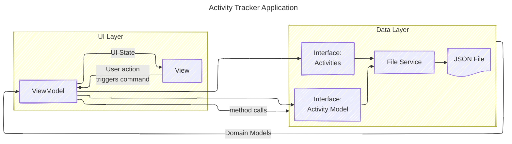

<!-- markdownlint-disable MD033 -->

# pppActivityTracker

Python tkinter GUI app to manage activity tracking for people.

Attributions included inline.

## Description

For fun, ppp stands for Paul Painter Python. pppActivityTracker is a simple GUI App to enter activities in a log with a start and stop time, a short descriptor of an activity and additional notes. The duration of the activity in minutes is computed. Weekly summaries of the activities can be shown.

The data is stored in a local json file.

An approximation of the MVVM pattern is employed. For starters, the viewmodel binds to the model using only a filename, or a simple json file binding. The main program defines an Application class which creates the view and the viewmodel supporting commands and properties.

## Project Structure

```txt
pppActivityTracker (project root)
│
├── model/
│   ├── ae.py (ActivityEntry dataclass)
│   └── atmodel.py (ActivityTracker Model)
│
├── viewmodel/
│   └── atviewmodel.py (Activity Tracker viewmodel)
│
├── view/
│   └── atview.py (Activity Tracker view)
│
├── tests/
│   ├── test_ae.py (unit test for ActivityEntry dataclass)
│   └── package2/
|
├── README.md
├── requirements.txt
└── main.py (The program main)
```

## MVVM Pattern Basics

First, attribution to [Divikiran Ravela](https://www.linkedin.com/pulse/understanding-mvvm-pattern-guide-junior-every-divikiran-ravela/) for his
succinct article [Understanding the MVVM Pattern: A Guide for Junior (every) Developers](https://www.linkedin.com/pulse/understanding-mvvm-pattern-guide-junior-every-divikiran-ravela/) from which I extracted these brief notes.

>In the MVVM Pattern, the relationships between the components are structured to maintain *Separation of Concerns*.

### The Model

>The Model represents the data and business logic of the application. It encapsulates the data and operations, ensuring that the data remains independent of the presentation logic.

### The View

>The View is responsible for presenting the user interface to the end-users. It displays the data to the user and captures their input.

### The ViewModel

>The ViewModel acts as a mediator between the View and the Model. It provides data and commands required by the View, often in the form of properties and methods, while abstracting the complexity of the Model from the View. This decoupling allows the View to be easily redesigned or replaced without affecting the underlying business logic.

### View knows about ViewModel

>The ViewModel holds a reference to the Model and interacts with it to retrieve and manipulate data. It transforms the data from the Model into a format suitable for the View and exposes it through properties that the View can bind to.

### Model remains unaware of the ViewModel

>The Model operates independently of the ViewModel and has no knowledge of it. This isolation allows the Model to evolve and change without affecting the ViewModel or the View, promoting modularity and flexibility.

With some help from [Microsoft Copilot](#copilotOne), here are some additional notes about the MVVM pattern.

### Key Components in MVVM Data Binding

In the MVVM design pattern, data binding is a core mechanism that connects the View (UI elements) with the ViewModel (the mediator between the View and Model). This binding ensures synchronization, meaning changes in the ViewModel automatically reflect in the View and, in some cases, vice versa. Data binding acts as a communication bridge between the View and ViewModel. It is typically implemented as a declarative link, often enabled through a framework or platform that supports this pattern.

#### Binding View to ViewModel

A ViewModel exposes properties as interfaces for a caller, in this case, the View. A common approach for this is to use a generic object known as the DataContext with the declared and bound properties names expected as getr/setr methods. Managing the naming conventions is typically framework-specific.

Each UI element, such as TextBox, CheckBox, etc., will have an associated binding to the name of the property available from the DataContext. The DataContext is initialized at setup time when a View is bound to a ViewModel. How I will set that up in python remains to be seen.

#### Binding ViewModel to View

Similarly, a ViewModel is bound to a Model using published interfaces. Code in the ViewModel is serving as a dispatcher between the View and the Model(s). How to declare this, in python code or configuration data, is yet to be seen. Several python projects have been created in the past to implement MVVM in python. But these are pretty heavy and the best one requires python support for Qt and I don't want to take the hit of learning Qt right now.

## Architecture

A high-level view of the ActivityTracking app is provided in the following diagram.



### Python Class Design

| Class Name  | Filename | Description |
| ----------- | -------- | ----------- |
| `ATModel` | `model/atmodel.py`| Activity Tracker Model class is the high level object containing the entire Model. It uses defined interfaces which are bound to specific Services for implementation.|
|`ActivityEntry`| `model/ae.py` | Activity Entry is a dataclass for a single activity.|
|`ATViewModel`|`viewmodel/atviewmodel.py`| The app's top-level ViewModel class.|
|`ATView`|`view/atview.py`| Top-level class of the View of the app. |
|`Application`|`main.py`| Class for the singleton application object.|
|``|``||

## Dependencies

Periodically capture the dependent python packages with:

`pip freeze > requirements.txt`

To update the dependent python modules, use the command:

`pip install --upgrade -r requirements.txt`

## References

<a id="copilotOne"></a>
**[Copilot-1]:** Results from Microsoft Copilot prompt "explain in detail the nature of data binding in the model view viewmodel design pattern" on March 11, 2025.
